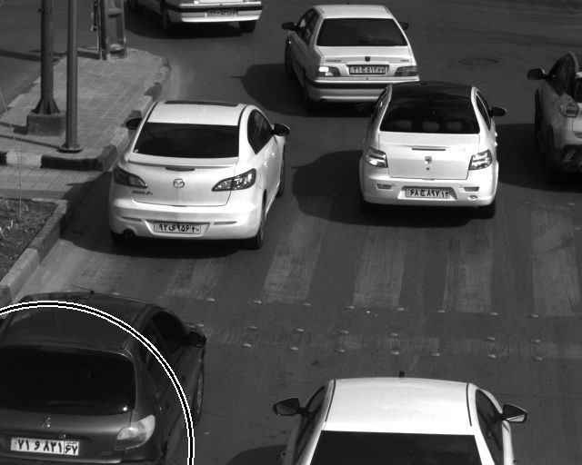
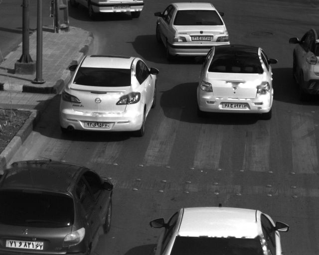

# White Circles Removal

I had a dataset containing images of vehicles
I wanted to train a classification model to detect the type of the vehicle ( bus , truck , minibus , van , sedan , pickup)

but I had a problem,
part of my dataset contained images of cars with a white circle around them ( as if the cars where detected by a detection model beforehand and the image was the output of that model)

for better results I decided to fill in the white circles and removing them as much as possible

#### Original Image:

#### Imgae after applying the code:

